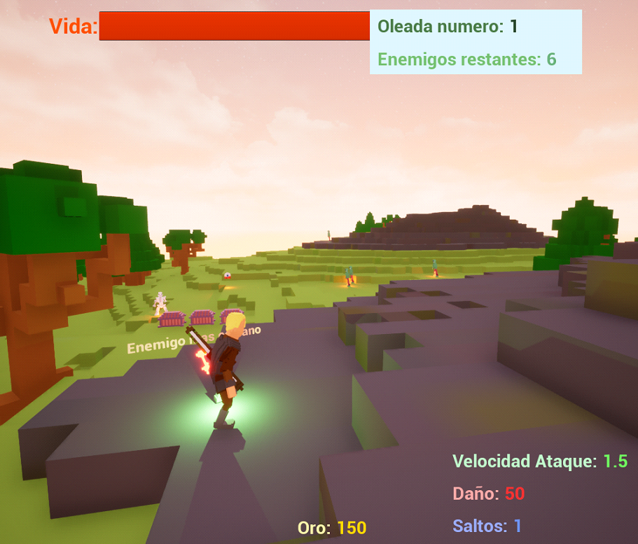

# **Risk Of Dying**
## Video Presentation

> Click on the image to watch

## In-Game Screenshot

## **Introduction**
The game is inspired by the roguelike **Risk of Rain**, but with several modifications. Key features include:

- Player can **shoot**, **move**, and **jump**.
- **Enemies** spawn randomly, chase, and attack the player.
- **Items** that increase stats are found in **randomly placed chests**.
- **Coins** are earned by killing enemies and used to open chests.
- **Wave system**: each wave adds more enemies. To progress, kill all enemies in the current wave.
- **Enemy tracker**: a magical arrow points to the nearest enemy.
---

## **Features**

### **Player**
- **Class**: Archer  
- **Stats**:  
  - 100 HP  
  - 50 arrow damage  
  - 1 jump  
  - 1.0 attack speed  
  - Starts with 0 gold  
- **Controls**:  
  - Move: `A` `W` `S` `D`  
  - Jump: `Space`  
  - Shoot: Left click *(click to shoot; no holding, has cooldown)*  
  - Interact: `E` *(open chests, pick up items)*

---

### **Enemies**
Enemies spawn via a **spawner** and drop a **random amount of gold**.

#### **Zombie**
- Melee attacker  
- Only chases if you're nearby  
- Hits on contact  
- **200 HP**

#### **Skeleton**
- Ranged attacker  
- Backs away when approached  
- Throws bones from a distance  
- **100 HP**

#### **Eye**
- Fast, random movement  
- Shoots beams at medium-long range  
- **50 HP**

---

### **Waves**
- Start at **Wave 1** with **6 enemies**.
- Kill all enemies to proceed.
- Each new wave spawns **+2 additional enemies**.
- Difficulty increases progressively.

---

### **Chests**
- First **3 chests** spawn in the center (player spawn).
- After collecting them, **new chests appear randomly** on the map.
- Once all are collected, more spawn—**loop continues infinitely**.
- **Opening a chest costs 30 gold.**

---

### **Items (from chests)**

- **Damage Up Axe**  
  +10 arrow damage  

- **Attack Speed Up Lantern**  
  +0.1 attack speed  
  *Also lights up surroundings*  

- **Jump Up Seeds**  
  +1 jump  

- **Life Bulb**  
  Dropped by enemies (25% chance)  
  +20 HP  
  *Helps survive longer*

---

### **Enemy Tracker**
- A **magical arrow** points toward the **closest enemy**.
- Useful when enemies are hard to find.
